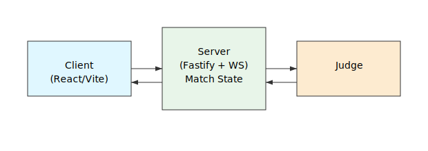

# The Glass Bead Game — Starter Repo (MVP Sprint 1)

Two‑player, online, AI‑judged prototype. This MVP includes:
- Realtime match state (in‑memory) via Fastify + WebSocket
- Shared TypeScript types and validation utilities
- Vite + React web client with Tailwind and a minimal graph‑like list
- AI Suggest button powered by the `useMatchState` hook
- JSON match log export (`GET /match/:id/log` or Export button in the UI)
- A stub **Magister Ludi** judge that scores basic Resonance/Aesthetics

## Quickstart
**Requirements:** Node 20+ (or 18+ with `--experimental-fetch`), npm 9+

Verify npm version and install dependencies from the repo root (no `--workspaces` flag):

```bash
npm --version  # should be 9+
npm install
npm run dev
# web: http://localhost:5173  |  server: http://localhost:8787
```
Or run `./start-dev.sh` to pull, install, build, and launch everything automatically.
If `npm install` fails with `Unsupported URL Type "workspace:"`, replace any `workspace:*` entries in subpackage `package.json`
files with relative `file:` links (e.g., `file:../../packages/types`).
Open two browser windows, choose distinct handles, and join/create the same match ID.
To export a match log for replay or analysis, use the **Export Log** button in the UI or `GET /match/{id}/log`.

## How to Play (MVP)
1. Run `npm run dev` and open the web client at `http://localhost:5173`.
2. In two browser windows, enter the same match ID to create or join a match.
3. Take turns casting beads (concepts) and binding them with strings (relationships).
4. Every move is validated by the server and synced live between players.
5. Export the log when finished for replay or analysis.

## Judge v0/v1
The current prototype includes a deterministic **Magister Ludi** judge (v0) that scores basic\
Resonance and Aesthetics. The planned v1 upgrade introduces path embeddings for Resonance,\
NLI contradiction checks for Integrity, and shingle/LSH rarity for Novelty.

## Scripts
- `npm run dev` — runs server + web concurrently
- `npm run build` — builds both
- `npm run typecheck` — type checks both

## Testing
Run all tests from the repo root:

```bash
npm test
```

Or target a workspace directly:

```bash
npm test --workspace apps/web
npm test --workspace packages/types
```

## Notes
- Data is in‑memory (ephemeral). Suitable for local testing.
- The judge is a deterministic stub; replace with your LLM/embedding pipeline later.
- See `/packages/types/src/index.ts` for the move schema.

## Architecture


## Additional Documentation
See [docs/](docs/README.md) for the project vision, product requirements, and development plan.
